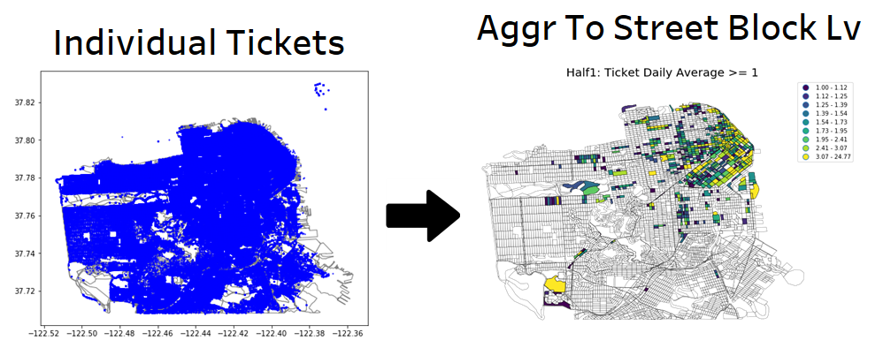

# San Francisco Municipal Transportation (Parking Citation)

**Objective:**   
SFMTA's parking citation department would like to transition from a one task role to a region-based deployment for their officers. Currently, officers are responsible for issuing one type of ticket. For instance, if an officer is assigned to ticket METERS, this individual will have to travel between part of San Francisco where meter exists. This result in a lot of travel time. In addition, when the individual sees a different violation, he/she will have to call another officer responsible for that violation and wait; therefore, an extra level of complexity and time-wasting step. With the new system, an officer is responsible for all possible violations in a predetermine region; therefore, eliminating the extra traveling and the need to call another person over.

### Automatic Zone Design and Dashboard  
Created a machine learning pipeline where we can clean data from the parking tickets, transform the GPS data into usable format, and then automatically create regions that held to preset desirable results using spatial constraint clustering. Based on our client, regions should have approximately 30 tickets daily. 
with the dashboard, upper management now can see past ticketing trends based on the proportion of different violation types in each region and regional daily average. In addition, management will finally be able officer performance because now there is a baseline based on past data. And this dashboard can be updated daily.

#### Prototype

---

### Executive Summary Report

